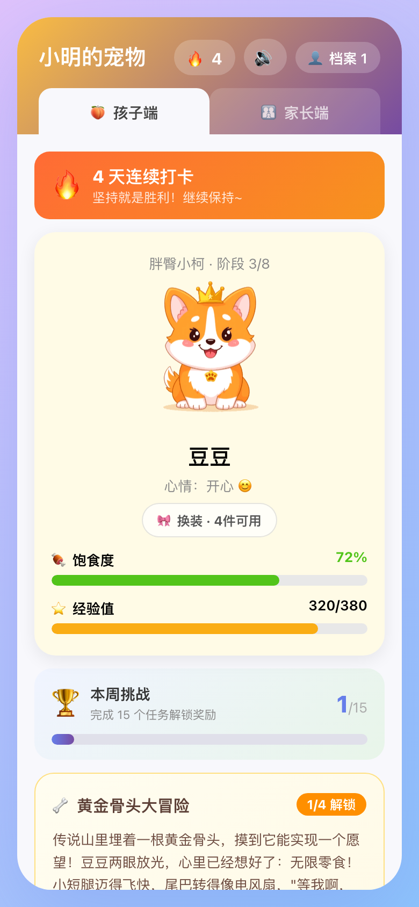
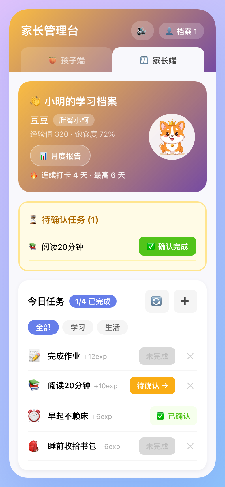
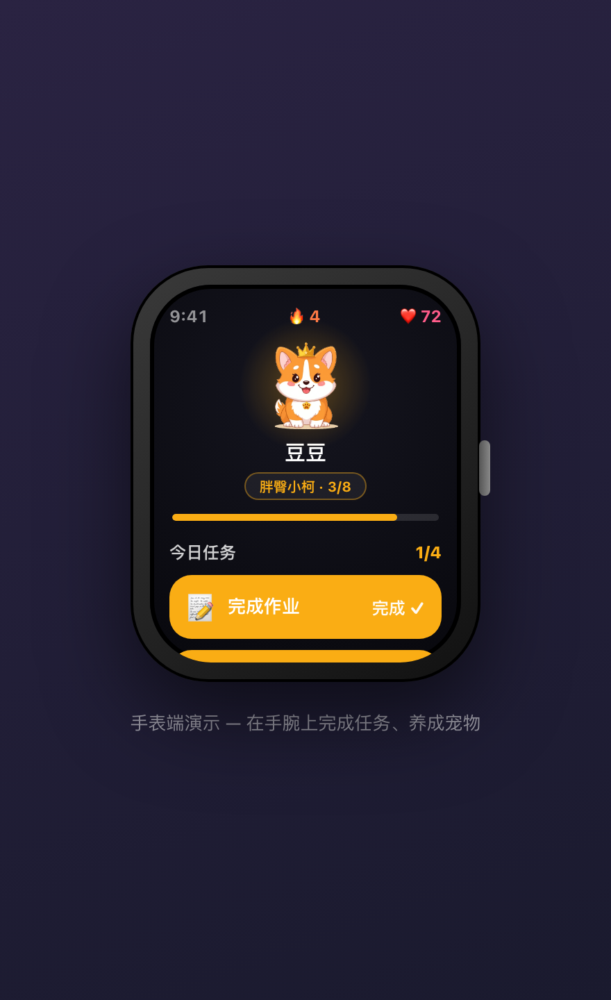
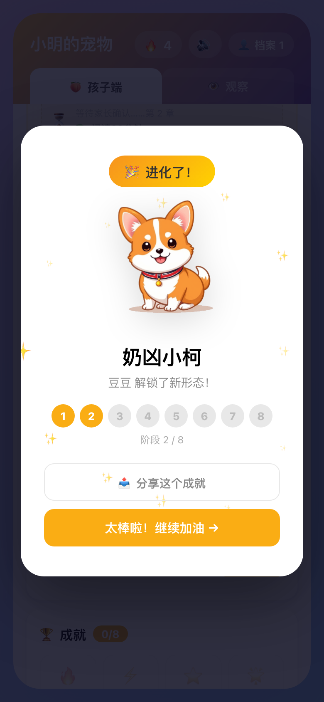
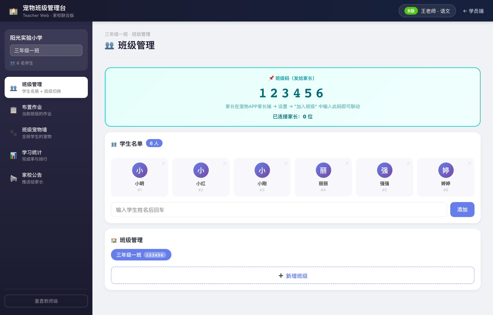
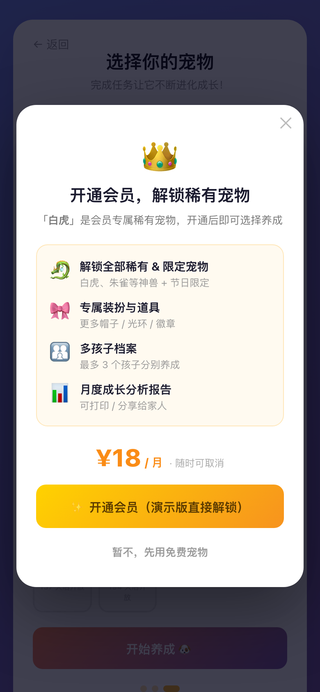

# 🐾 宠物学习 APP · Pet Learning Quest

> 让孩子通过「养宠物」爱上学习 —— 完成任务喂养宠物、积累经验进化成长。
> A pet-raising habit-tracker that motivates kids to learn: finish tasks → feed your pet → watch it evolve.


一套宠物养成激励系统，面向 6–12 岁儿童的家庭学习场景，**一份状态、四端协同**。
A single pet-progression system spanning **four synchronized clients** — child, parent, teacher, and smartwatch.

> 🎞️ **项目介绍幻灯片 / Slides**（HTML，方向键翻页，23 页）：[中文版](项目介绍-中文.html) · [English](项目介绍-EN.html)

---

## ✨ 项目简介 / Overview

**中文**：孩子完成每日学习/生活任务来喂养、进化自己的虚拟宠物；家长布置与确认任务、查看成长报告；老师按班级布置作业并追踪完成情况；还有一个手表端可随手打卡。所有端共享同一套本地状态，实时同步。

**English**: Kids complete daily tasks to feed and evolve a virtual pet. Parents assign & confirm tasks and view growth reports. Teachers manage classes, assign homework, and track completion. A smartwatch client allows quick check-ins on the go. All clients share one local state and sync in real time.

> 这是一个**作品集项目 / portfolio piece**，纯前端、用 `localStorage` 持久化，无需后端即可完整运行。

---

## 🖥️ 四端演示 / Four Clients

| 🐶 孩子端 Child (`/`) | 👨‍👩‍👧 家长端 Parent (`/#parent`) |
|:--:|:--:|
|  |  |
| 养成主界面：完成任务→喂养→进化 | 布置/确认任务、成长报告、模式与 PIN |

| ⌚ 手表端 Watch (`/#watch`) | 🎉 进化时刻 Evolution |
|:--:|:--:|
|  |  |
| 儿童手表场景：一键完成今日任务 | 升级全屏庆祝 + 8 阶段进度 + 分享 |

### 🖥️ 教师管理端 Teacher (`/#teacher`)



班级名册、布置作业、班级宠物墙、学习统计、家校公告（生成班级码连接家长）。

### 💎 稀有宠会员付费墙 Paywall



借鉴 Prodigy 模式：基础宠免费，稀有/限定宠需开通会员（演示版直接解锁）。

---

## 🎯 核心特性 / Features

- **🐣 8 阶段进化体系** — 每只宠物 `lv1→lv8` 八段成长，经验阈值驱动，高阶附带光环/光芒特效
  *8-stage evolution per pet, EXP-threshold driven, with aura effects at high stages.*
- **🎮 多重激励** — 连续打卡奖励、经验里程碑、成就系统、每日登录、周挑战
  *Streaks, EXP milestones, achievements, daily-login & weekly challenges.*
- **🧩 三种使用模式** — 家庭（家长确认）/ 校园（完成即结算）/ 家校联合
  *Family / Campus / School-Home modes.*
- **🐉 10+ 宠物** — 4 免费基础宠 + 2 会员稀有宠（白虎/朱雀）+ 4 节日限定宠
  *10+ pets incl. premium & seasonal ones.*
- **💰 会员付费墙** — 稀有宠物解锁的变现设计（Prodigy 式 C 端付费）
- **📚 学习内容引擎** — 口算 / 闪卡 / 计时任务
- **♿ 无障碍 & PWA** — 键盘焦点环、`prefers-reduced-motion`、44px+ 触控目标、可安装
- **🔒 家长 PIN** — Web Crypto（SHA-256 + PBKDF2）
- **✅ 工程化** — vitest 单测（27 通过）、ESLint 0 问题、代码分割、i18n、schema 迁移

---

## 🛠️ 技术栈 / Tech Stack

`React 19` · `Vite 8` · `Vitest` · `ESLint` · 纯前端 + `localStorage` · PWA（manifest + service worker）

宠物美术为本地透明底 PNG（`public/pets/`），可在浅色卡片与深色手表屏上自然融合。

---

## 🚀 本地运行 / Getting Started

```bash
npm install      # Node 18+（建议 v22）
npm run dev      # → http://localhost:5173/
```

| 命令 Command | 说明 |
|------|------|
| `npm run dev` | 开发服务器 / dev server |
| `npm run build` | 生产构建 / production build |
| `npm run preview` | 预览构建产物 / preview build |
| `npm test` | 单元测试 / unit tests |
| `npm run lint` | 代码检查 / lint |

**入口路由 Routes**：`/`（孩子）· `#parent`（家长）· `#teacher`（教师）· `#watch`（手表）· `#admin`（配置后台）
**演示班级码 Demo class code**：`123456`

---

## 📂 项目结构 / Project Structure

```
src/
├── App.jsx              # 路由分发四端 + 孩子端主壳
├── store.js             # 核心状态 hook + 宠物定义 + 经验/进化/成就/会员
├── teacher-store.js     # 教师数据层 + 班级码共享桥
├── teacher-bridge.js    # store ↔ teacher-store 解耦层
├── learn-content.js     # 学习内容引擎    stories.js  宠物故事
├── pin-crypto.js        # 家长 PIN 加密   state-migrations.js  schema 迁移
├── constants/           # 模式常量 + 模式元数据
├── components/          # 23+ 组件（PetView/ParentView/TeacherView/WatchView/PaywallModal…）
└── __tests__/           # vitest 单测
public/pets/<type>/lv1~lv8.png   # 透明底宠物美术（6 类 × 8 阶）
```

---

## 📊 竞品研究 / Market Research

项目附带市场调研，体现产品与设计思考：
- [竞品分析报告.md](竞品分析报告.md) —— 11 款竞品（酷课堂、ClassDojo、Prodigy、Duolingo…）横向对比、市场空白、商业模式
- [竞品宠物视觉分析.html](竞品宠物视觉分析.html) —— 竞品宠物美术风格与**升级路线**分析

---

## 📄 License

[MIT](LICENSE) © 2026 William

> 作品集项目，宠物美术资源来自开源仓库 `class-pet-garden`（已做透明化处理）。
> Portfolio project. Pet artwork derived from the open-source `class-pet-garden` repo.
